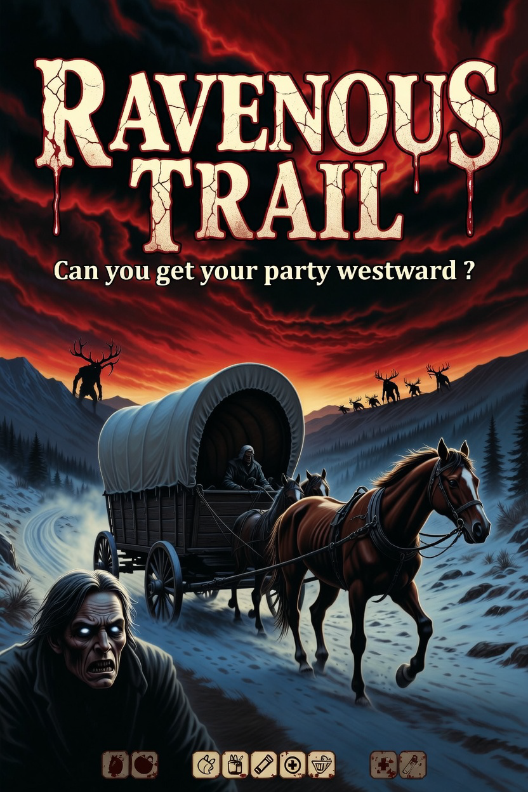

# Ravenous Trail

**Can you get your party westward ?**

A narrative, story-driven web game inspired by *The Oregon Trail* and the 1999 film *Ravenous*.

Lead a party of settlers across a one-time procedurally generated map from east to west. Fixed landmarks include forts, rivers, mountains, and Indian settlements. Manage hunger, morale, supplies, and the growing suspicion that something monstrous is traveling with you.

## Game Features (Planned)
- Procedural map generation with fixed iconic points
- Resource management (food, ammo, medicine)
- Narrative events with choices
- Wendigo horror mechanics
- Built with HTML/JS, Azure hosting ready
- Open source on GitHub

Play the game → [Live Demo](https://swiftsolves-msft.github.io/Ravenous-Trail/) (coming soon)

Contribute: Fork, open issues, submit PRs!

---
*"You know how it is... once you taste it, you can't stop."* — *Ravenous*
